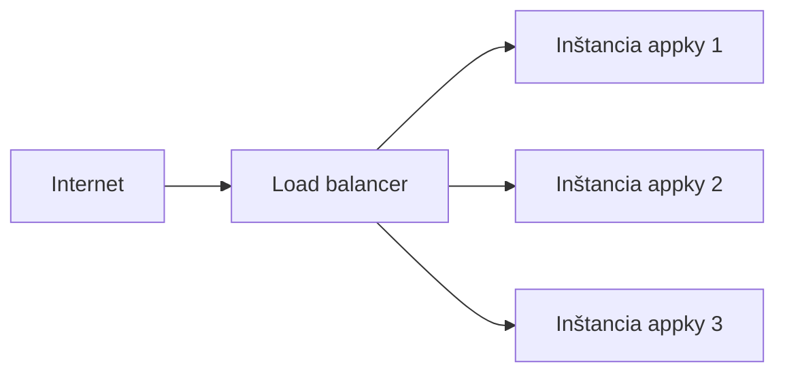
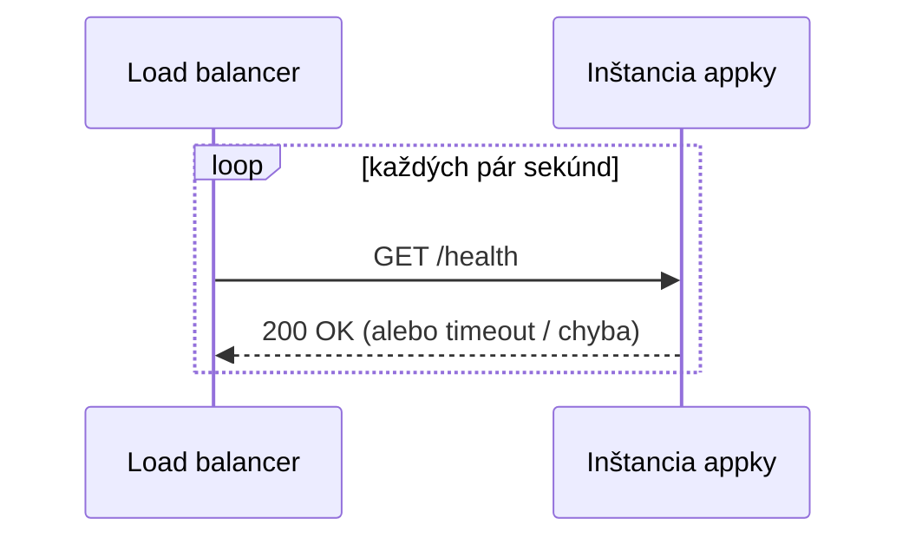

# Základy Load Balancingu

Load balancer rozkladá prichádzajúce požiadavky naprieč **viacerými** inštanciami rovnakého
backendu, namiesto toho, aby ich všetky obsluhoval jeden cieľ reverse proxy sám. Rovnaký
podkladový mechanizmus ako reverse proxy (pozri [Reverse Proxy](./reverse-proxies.md)) —
rozhodovanie o smerovaní — len smerovanie naprieč replikami jednej služby namiesto k rôznym
službám.

## Prečo

- **Kapacita** — jedna inštancia má strop, koľko prevádzky zvládne; viac inštancií tento strop
  zvýši.
- **Dostupnosť** — ak jedna inštancia spadne alebo sa práve nasadzuje/reštartuje, ostatné
  naďalej obsluhujú prevádzku. Toto umožňuje nasadenia bez výpadku.

## Bežné stratégie

| Stratégia | Ako vyberie inštanciu |
|---|---|
| Round robin | Cyklicky prechádza inštancie v poradí, jedna požiadavka na každú |
| Least connections | Pošle na inštanciu s aktuálne najmenej aktívnymi požiadavkami |
| IP hash | Rovnaká klientská IP vždy smeruje na rovnakú inštanciu (užitočné pre session affinity) |

## Health checky

Load balancer potrebuje vedieť, kedy je inštancia skutočne pokazená, nie na ňu smerovať naslepo:

Inštancia, ktorá prestane odpovedať na health checky, sa automaticky vyradí z rotácie, kým sa
nezotaví — presne toto umožňuje rolling deploy nahradiť inštancie jednu po druhej bez toho, aby
sa čo i len jedna požiadavka dostala na mŕtvu.

## Kde toto (ne)platí tu

Aktuálne nastavenie tejto organizácie — jeden VPS, jeden kontajner na appku (pozri
[`/sk/internal-operations/server-architecture`](/sk/internal-operations/server-architecture)) —
nespúšťa viacero replík docs stránky, takže dnes tu žiadny load balancer nie je v hre; Caddy tu
funguje čisto ako reverse proxy smerujúci podľa hostname, nie rozkladajúci záťaž naprieč
inštanciami. Táto stránka je tu ako koncept, po ktorom by si siahol, keby/až potreby na prevádzku
alebo dostupnosť prerástli jednu inštanciu — nie popis aktuálneho nastavenia.
