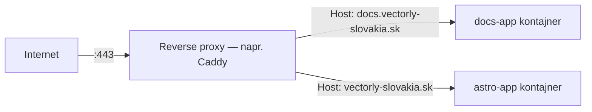

# Reverse Proxy

**Reverse proxy** sedí pred jedným alebo viacerými backend servermi, prijíma všetku prichádzajúcu
prevádzku ako prvý, a rozhoduje, ktorý backend danú požiadavku skutočne obslúži. Volajúci sa vždy
rozprávajú len s proxy — nikdy sa nepripájajú priamo na backend.



## Prečo vôbec dávať niečo pred appku

- **Smerovanie podľa hostname** — jeden server, jedna verejná IP, veľa domén/subdomén, každá
  nasmerovaná na iný backend. Presne takto `docs.vectorly-slovakia.sk` a `vectorly-slovakia.sk`
  zdieľajú rovnaký VPS, ale dostávajú sa k rôznym kontajnerom.
- **TLS termination** — proxy rieši HTTPS certifikáty raz, centrálne; backend appky môžu interne
  hovoriť obyčajným HTTP (pozri [TLS a HTTPS](./tls-https.md)).
- **Jeden, kontrolovaný vstupný bod** — backendy nemusia byť dostupné z internetu vôbec, len proxy
  musí byť, čo zmenšuje, čo treba zabezpečovať/patchovať proti priamemu vystaveniu.
- Tiež bežne rieši: kompresiu, cachovanie, rate limiting, load balancing naprieč viacerými
  backend inštanciami (pozri [Základy Load Balancingu](./load-balancing-basics.md)).

## Minimálny Caddy príklad

```caddyfile title="Caddyfile"
docs.vectorly-slovakia.sk {
    reverse_proxy docs-app:80
}

vectorly-slovakia.sk, www.vectorly-slovakia.sk {
    reverse_proxy astro-app:80
}
```

Caddy číta hlavičku `Host` na každej prichádzajúcej požiadavke, porovná ju s týmito blokmi a
presmeruje na pomenovaný backend — `docs-app:80` je tu názov Docker kontajnera + port, dostupný,
lebo oba kontajnery sedia na rovnakej Docker sieti (`proxy-net` v nastavení tejto organizácie —
pozri [`/sk/internal-operations/server-architecture`](/sk/internal-operations/server-architecture)).

## Reverse proxy vs. forward proxy

Ľahko sa to popletie:

- **Reverse proxy** — sedí pred *servermi*, skrýva, ktorý backend obslúžil požiadavku. Klient
  nevie ani netuší, ktorý backend odpovedal.
- **Forward proxy** — sedí pred *klientmi*, skrýva, ktorý klient urobil požiadavku (napr. firemný
  proxy, alebo SOCKS proxy z [SSH Tunelovanie](../02-ssh/ssh-tunneling.md)). Server nevie, ktorý
  reálny klient sa pýta.

## Basic auth na úrovni proxy

Reverse proxy môže tiež kontrolovať prístup skôr, než požiadavka vôbec dorazí k appke — takto je
chránená táto docs stránka samotná:

```caddyfile
docs.vectorly-slovakia.sk {
    basicauth /* {
        bnovak <bcrypt-hash>
    }
    reverse_proxy docs-app:80
}
```

Appka samotná nemá o autentifikácii žiadnu vedomosť — Caddy odmietne neautentifikované
požiadavky skôr, než sa dostanú k `docs-app`.

## Skontroluj sa

- `docs.vectorly-slovakia.sk` a `vectorly-slovakia.sk` zdieľajú jeden VPS a jednu verejnú IP, ale
  dostávajú sa k rôznym kontajnerom. Čo to umožňuje?

  <details>
  <summary>Odpoveď</summary>

  Reverse proxy číta hlavičku `Host` na každej prichádzajúcej požiadavke a smeruje ju na iný
  backend v závislosti od toho, ktorý hostname bol požadovaný.
  </details>

- Aký je skutočný rozdiel medzi reverse proxy a forward proxy — pred ktorou stranou pripojenia
  každý sedí?

  <details>
  <summary>Odpoveď</summary>

  Reverse proxy sedí pred servermi, skrýva pred klientom, ktorý backend odpovedal. Forward proxy
  sedí pred klientmi, skrýva pred serverom, ktorý klient urobil požiadavku.
  </details>

- Ak Caddy rieši basic auth na úrovni proxy, potrebuje backend appka nejakú vedomosť o
  autentifikácii?

  <details>
  <summary>Odpoveď</summary>

  Nie — Caddy odmietne neautentifikované požiadavky skôr, než sa vôbec dostanú k appke, tak appka
  nemá o autentifikácii žiadnu vedomosť.
  </details>

