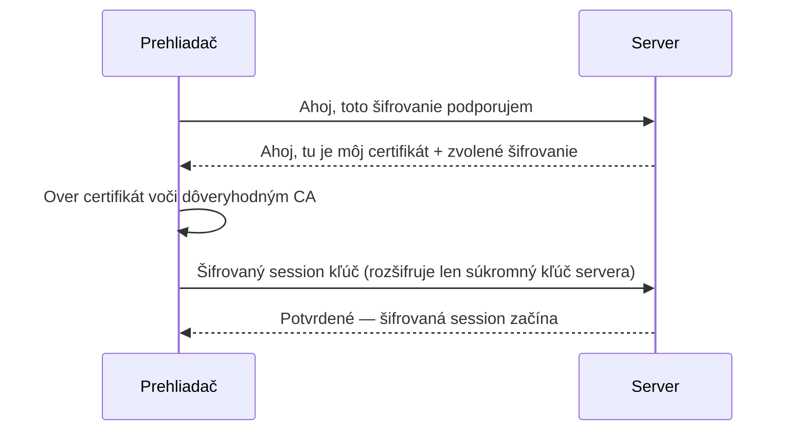
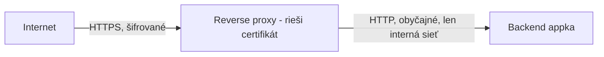

# TLS a HTTPS

**HTTPS** je HTTP bežiaci cez **TLS** (Transport Layer Security) — rovnaké požiadavky a odpovede,
ale šifrované počas prenosu, plus dôkaz, že sa rozprávaš so serverom, o ktorom si myslíš, že sa
rozprávaš.

## Čo ti TLS naozaj prináša

- **Šifrovanie** — ktokoľvek odpočúvajúci prevádzku (Wi-Fi v kaviarni, ISP, man-in-the-middle)
  vidí zamiešané bajty, nie obsah tvojho login formulára.
- **Autentifikácia** — certifikát, vydaný dôveryhodnou certifikačnou autoritou (CA), dokazuje, že
  server je tým, za koho sa vydáva. Bez toho by samotné šifrovanie nezabránilo niekomu vydávať sa
  za skutočný server.
- **Integrita** — manipulácia s dátami počas prenosu je detekovateľná, nie len neviditeľná.

## Handshake, zjednodušene



Po tomto handshake je všetka následná HTTP prevádzka na spojení šifrovaná pomocou vyjednaného
session kľúča — krok s certifikátom/CA sa deje len raz na spojenie, nie na každú požiadavku.

## Certifikáty a Let's Encrypt / ACME

Certifikát vydáva CA a potrebuje pravidelnú obnovu (typicky každých 90 dní pri
[Let's Encrypt](https://letsencrypt.org/) certifikátoch). Ručná obnova podľa harmonogramu je
presne to, čo sa oplatí automatizovať — protokol **ACME** umožňuje serveru dokázať vlastníctvo
domény a získať/obnoviť certifikáty bez zásahu človeka.

Caddy (používaná touto organizáciou — pozri [Reverse Proxy](./reverse-proxies.md)) to robí
**automaticky** predvolene: nasmeruj doménu na ňu, a ona si vyžiada, nainštaluje a obnoví Let's
Encrypt certifikát s nulovou manuálnou konfiguráciou. Toto je veľká časť dôvodu, prečo je Caddy
obľúbená voľba reverse proxy oproti ručnej konfigurácii `certbot` + nginx.

## Prečo terminovať TLS na reverse proxy



Proxy dešifruje raz, potom hovorí obyčajným HTTP s backend kontajnermi cez internú Docker sieť —
tieto kontajnery nikdy nepotrebujú vlastné certifikáty, a interná prevádzka, ktorá nikdy neopustí
server, veľa nezíska tým, že by bola samostatne šifrovaná. Toto je štandardná prax, nie skratka —
presne to znamená "TLS termination".

:::note
Toto platí len preto, že interná sieť medzi proxy a appkou je naozaj súkromná (Docker bridge
sieť nedostupná zvonku, ako v
[`/sk/internal-operations/server-architecture`](/sk/internal-operations/server-architecture)).
Obyčajný HTTP cez sieť, ktorú plne nekontroluješ, popiera celý zmysel.
:::

## Kontrola certifikátu

```bash
curl -vI https://docs.vectorly-slovakia.sk 2>&1 | grep -A5 "Server certificate"
openssl s_client -connect docs.vectorly-slovakia.sk:443 -servername docs.vectorly-slovakia.sk
```

## Skontroluj sa

- Šifrovanie samotné (bez certifikátu/CA) by zastavilo odpočúvanie, ale aký útok by stále nechalo
  možný?

  <details>
  <summary>Odpoveď</summary>

  Niekoho vydávajúceho sa za skutočný server — autentifikácia (certifikát, overený voči
  dôveryhodnej CA) je to, čo dokazuje, že server je tým, za koho sa vydáva, oddelene od
  samotného šifrovania.
  </details>

- Deje sa krok overenia certifikátu/CA pri každej jednej HTTP požiadavke cez TLS spojenie, alebo
  raz na spojenie?

  <details>
  <summary>Odpoveď</summary>

  Raz na spojenie — po handshake všetky nasledujúce požiadavky na tom spojení znovu použijú už
  vyjednanú šifrovanú session.
  </details>

- Prečo je v poriadku, aby backend kontajnery medzi sebou hovorili obyčajným HTTP cez internú
  Docker sieť, keď je obyčajný HTTP inak zlý nápad?

  <details>
  <summary>Odpoveď</summary>

  Tá interná sieť je naozaj súkromná (Docker bridge sieť nedostupná zvonku), tak niet nikoho v
  pozícii ju odpočúvať tak, ako na otvorenom internete — reverse proxy už vyriešil šifrovanie pre
  skutočný internetu-vystavený skok.
  </details>

