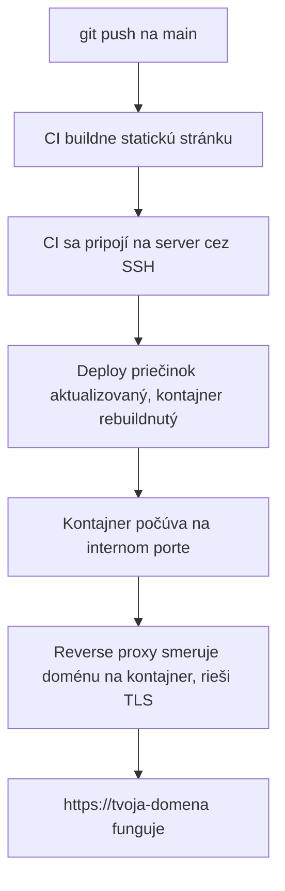

# Nasadenie Statickej Stránky

Spája všetko ostatné v tejto sekcii do jednej konkrétnej cesty: statická stránka (Docusaurus,
Astro, čokoľvek, čo sa buildne na obyčajné HTML/CSS/JS) od `git push` po fungujúcu `https://`
doménu.

## Celá reťaz



Každá šípka tu zodpovedá už popísanej stránke:
[Základy SSH](../02-ssh/ssh-basics.md) (C), [Nasmerovanie Domény na Server](../03-domains-and-dns/pointing-a-domain-at-a-server.md)
(F/G), [Reverse Proxy](../04-web-serving/reverse-proxies.md) a
[TLS a HTTPS](../04-web-serving/tls-https.md) (F).

## Ako to naozaj beží pre túto stránku

1. Push na `main` → spustí sa GitHub Actions workflow (pozri
   [`/sk/internal-operations/git-workflow`](/sk/internal-operations/git-workflow)).
2. Workflow sa SSH-ne na VPS pomocou dedikovaného deploy kľúča (`vectorly_docs_key`, cez
   `github-docs` SSH konfiguračný alias — pozri [SSH Konfigurácia](../02-ssh/ssh-config.md)).
3. `docker compose up -d --build` rebuildne a reštartuje kontajner `docs-app` v
   `/opt/vectorly-docs`.
4. `docs-app` počúva na porte 80 **len interne** — nie priamo vystavený internetu.
5. Caddy, už bežiaci a pripojený k rovnakej Docker sieti (`proxy-net`), zachytí prichádzajúce
   požiadavky na `docs.vectorly-slovakia.sk` a presmeruje ich cez reverse proxy na `docs-app:80`,
   sám riešiac TLS termination.

Pozri [`/sk/internal-operations/server-architecture`](/sk/internal-operations/server-architecture)
pre presné názvy kontajnerov, Caddy konfiguráciu a SSH nastavenie kľúčov, ktoré táto stránka
popisuje všeobecnejšie.

## Prečo sa appka samotná nikdy nedotýka portov 80/443 priamo

Len Caddy je vystavený internetu. Každý ostatný kontajner sedí na internej `proxy-net` bridge
sieti, dostupný pre Caddy, ale nie priamo pre vonkajší svet — jedna vec na udržiavanie
patchovanú a zabezpečenú proti priamemu vystaveniu, namiesto každej appky samostatne.

## Riešenie pokazeného nasadenia

Prechádzaj reťaz odzadu namiesto hádania:

```bash
ssh docs-server "docker ps"                       # 1. beží kontajner vôbec?
ssh docs-server "docker logs docs-app"              # 2. spadol / chyboval pri štarte?
ssh docs-server "curl -sI http://localhost:80"       # 3. počúva naozaj interne?
curl -sI https://docs.vectorly-slovakia.sk            # 4. funguje celá verejná reťaz?
```

Ak (3) funguje, ale (4) nie, problém je v Caddy/DNS/TLS, nie v appke —
[Riešenie Problémov s Pripojením](./troubleshooting-connectivity.md) má viac tohto prístupu.
