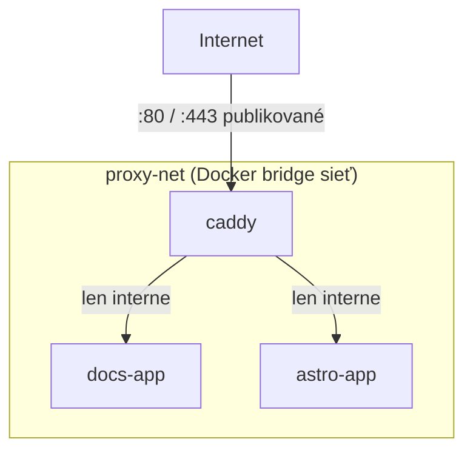

# Základy Docker Networkingu

Kontajnery sa potrebujú medzi sebou rozprávať (appka → databáza, proxy → appka) bez toho, aby to
nutne vystavili vonkajšiemu svetu. Docker sieťový model je to, čo toto umožňuje.

## Bridge siete

**Bridge sieť** je súkromná virtuálna sieť, ku ktorej sa dajú pripojiť kontajnery — kontajnery na
rovnakej bridge sieti sa vedia dosiahnuť podľa **názvu kontajnera**, bez toho, aby boli akékoľvek
porty publikované na hostiteľský počítač vôbec.

```bash
docker network create proxy-net
docker run --network proxy-net --name docs-app docs-image
docker run --network proxy-net --name caddy caddy-image
```

Teraz, zvnútra kontajnera `caddy`:

```bash
curl http://docs-app:80      # funguje — "docs-app" sa resolvuje cez internú Docker DNS
```

...ale `docs-app:80` **nie je** dostupný z hostiteľského počítača ani z internetu, pokiaľ nie je
tento port explicitne publikovaný (`-p`).

## Prečo kontajnery tejto organizácie zdieľajú `proxy-net`



Len porty Caddy sú publikované na hostiteľa (a odtiaľ na internet). `docs-app` a `astro-app` sú
dostupné *podľa mena* z Caddy cez `proxy-net`, ale nemajú žiadnu cestu dnu zvonku vôbec — toto je
mechanizmus za
["len Caddy je vystavený priamo"](./deploying-a-static-site.md) popísaným na predchádzajúcej
stránke.

## Publikované vs. interné porty

```bash
docker run -p 8080:80 my-app     # port 8080 hostiteľa -> port 80 kontajnera, dostupný zvonku
docker run my-app                  # žiadne -p vôbec: dostupný len ostatnými kontajnermi na rovnakej sieti
```

`-p HOST:CONTAINER` je jediná vec, ktorá spraví port kontajnera dostupný zvonku Dockeru vôbec —
všetko ostatné je predvolene len interné, čo je bezpečnostná vlastnosť, na ktorú sa oplatí
zámerne spoliehať (ako to robí nastavenie tejto organizácie), nie len detail implementácie.

## `docker compose` a siete

`docker-compose.yml` automaticky vytvorí sieť na projekt, pokiaľ mu nepovieš inak; na zdieľanie
jednej siete naprieč viacerými nezávisle nasadzovanými compose projektmi (ako s `proxy-net` tu,
zdieľanou medzi docs stránkou a samostatnými repozitármi hlavnej marketingovej stránky), ju
deklaruj ako `external: true`:

```yaml title="docker-compose.yml"
services:
  docs-app:
    build: .
    networks:
      - proxy-net

networks:
  proxy-net:
    external: true
```

`external: true` povie Compose "táto sieť už existuje, nesnaž sa ju vytvoriť" — musí byť vytvorená
raz (`docker network create proxy-net`) skôr, než môže ktorýkoľvek compose projekt, ktorý ju
používa, naštartovať.
