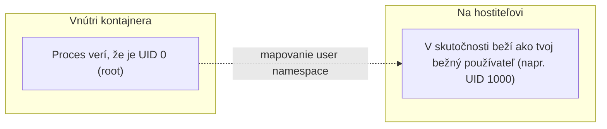

# Rootless Predvolene

Praktický, bezpečnostne relevantný dôsledok bezdémonovej architektúry Podman (pozri
[Čo je Podman](./what-is-podman.md)): bežný, non-root používateľ vie spúšťať Podman kontajnery bez
špeciálneho nastavenia, vôbec bez potreby root oprávnení.

## Porovnanie s Dockerom

```bash
# Docker: tvoj používateľ typicky musí byť v skupine "docker"
usermod -aG docker deploy
```

Byť v skupine `docker` udelí prístup k socketu Docker daemona — čo, keďže daemon tradične beží ako
root, je funkčne ekvivalentné root prístupu na hostiteľovi (pozri
[Sudo a Root](/sk/study-materials/linux-shell/permissions-and-users/sudo-and-root) v téme Linux &
Shell, a jej poznámku o zaobchádzaní s členstvom v `docker` skupine s rovnakou opatrnosťou ako so
sudo právami). Toto je zámerný, pochopený kompromis v dizajne Dockeru, nie prehliadnutie — ale
znamená to, že "môže spúšťať kontajnery" a "má root-ekvivalentný prístup" sú v praxi to isté
oprávnenie.

```bash
# Podman: žiadny daemon, žiadna špeciálna skupina netreba
podman run -d nginx      # beží ako tvoj vlastný bežný používateľ, žiadny zvýšený prístup vôbec
```

## Ako rootless kontajnery naozaj fungujú

Rootless Podman kontajner stále používa namespaces a cgroups (pozri
[Čo je Kontajner](/sk/study-materials/docker/basics/what-is-a-container) v Docker téme) — proces
kontajnera beží so skutočným UID tvojho vlastného bežného používateľa na hostiteľovi, zatiaľ čo
Linuxove **user namespaces** mu dovolia *pôsobiť* ako root **vnútri** vlastného izolovaného
pohľadu kontajnera, bez toho, aby sa to vôbec mapovalo na skutočné root oprávnenia na hostiteľovi.



Aplikácia vnútri kontajnera, ktorá očakáva beh ako root (mnohé to konvenčne robia), stále funguje
normálne — len neudeľuje skutočný root prístup k hostiteľovi, ak sa z kontajnera nejako unikne.

## Prečo na tomto konkrétne záleží pre bezpečnosť

Ak je kontajner kompromitovaný (zraniteľnosť v samotnej kontajnerizovanej appke, alebo
container-escape bug), praktický dosah škody je obmedzený tým, čo mohol robiť **host používateľ**,
ktorý ho spustil — nie root, lebo pri rootless kontajneri vo väčšine prípadov vôbec nie je v hre
root-privilegovaný daemon alebo proces. Toto priamo zúži najhorší možný výsledok kompromitácie
kontajnera v porovnaní s nastavením, kde daemon (a tým efektívne aj každý kontajner, ktorý
spravuje) beží ako root.

:::note
Docker *vie* tiež bežať rootless (`dockerd-rootless`), a toto porovnanie nie je "Docker je
nebezpečný" — je to, že rootless je predvolený, bez extra nastavenia režim Podman, zatiaľ čo
predvolená inštalácia Dockeru je stále tradičný root daemon, s rootless ako opt-in alternatívou,
ktorú väčšina nastavení sa neobťažuje zapnúť.
:::

## Skutočné limity rootless prevádzky

Nie všetko funguje identicky rootless — niektoré veci naozaj potrebujú skutočný root:

```text
Funguje fajn rootless:        Väčšina typických app kontajnerov, web servery, väčšina databáz
Potrebuje extra config/root:    Bindovanie na porty pod 1024 bez extra nastavenia, niektoré pokročilé
                                  sieťové režimy, isté hraničné prípady oprávnení volumes
```

Priame bindovanie na port 80 rootless si napríklad vyžaduje buď beh ako root aj tak, alebo kernel
nastavenie (`net.ipv4.ip_unprivileged_port_start`) na zníženie prahu privilegovaných portov —
oplatí sa vedieť, než predpokladáš, že rootless je drop-in náhrada za každé existujúce Docker
nastavenie bez akýchkoľvek úprav vôbec.
