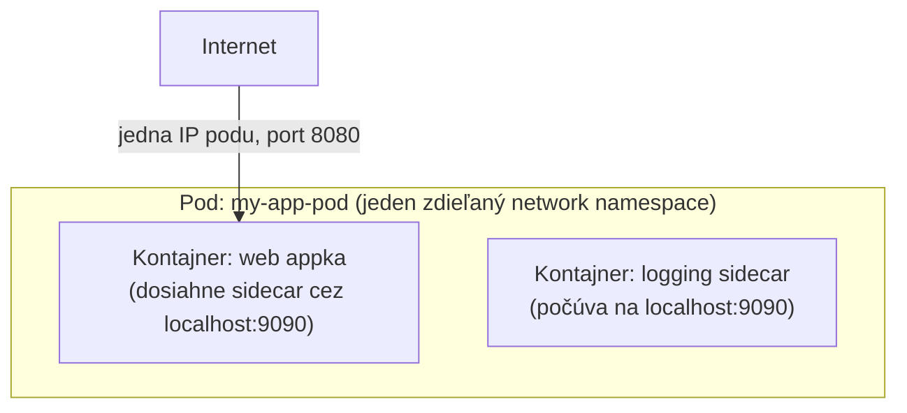

# Koncept Pod

Jediná naozaj nová myšlienka, ktorú Podman zavádza a pre ktorú obyčajný Docker nemá priamy
ekvivalent — a nie je náhoda, že názov "Podman" (**Pod** Man**ager**) je na nej postavený.

## Čo je pod

**Pod** je skupina jedného alebo viacerých kontajnerov, ktoré zdieľajú určité zdroje — najmä
rovnaký **network namespace** (zdieľajú jednu IP adresu, a vedia sa navzájom dosiahnuť cez
`localhost`) a vedia zdieľať úložisko. Toto je zámerne rovnaký koncept, a rovnaký termín, ako
Kubernetes pod — pod model Podman má priamo zrkadliť ten Kubernetes, spôsobom, o ktorý sa
obyčajný model kontajnerov Dockeru ani nepokúša.



## Vytvorenie a použitie podu

```bash
podman pod create --name my-app-pod -p 8080:8080

podman run -d --pod my-app-pod --name web my-web-image
podman run -d --pod my-app-pod --name sidecar my-sidecar-image
```

`web` aj `sidecar` teraz zdieľajú jeden network namespace — `web` dosiahne `sidecar` cez
`localhost:9090` (nech je akýkoľvek port, na ktorom `sidecar` počúva) bez akejkoľvek Docker-style
vlastnej siete alebo DNS rozlišovania podľa mena služby (pozri
[Porty a Sieťové Režimy](/sk/study-materials/docker/networking-and-storage/ports-and-network-modes)
v Docker téme pre to, ako Docker rieši ekvivalentnú potrebu multi-kontajnerovej komunikácie
odlišne, cez pomenované bridge siete namiesto zdieľaného namespace).

## Správa podu ako jednej jednotky

```bash
podman pod ps                    # vypíš pody
podman pod stop my-app-pod         # zastav každý kontajner v pode spolu
podman pod rm my-app-pod             # odstráň pod a jeho kontajnery
```

## Prečo sa toto tak priamo mapuje na Kubernetes

Vlastný pod koncept Kubernetes funguje rovnako — jeden alebo viacero kontajnerov zdieľajúcich
network namespace, typicky hlavný kontajner plus jeden alebo viacero "sidecar" kontajnerov
(logging, proxy, metrics exporter), ktoré potrebujú tesný, localhost-level prístup k hlavnému
kontajneru. Pod model Podman existuje konkrétne preto, aby lokálne multi-kontajnerové nastavenie
mohlo tesne zrkadliť to, ako by sa naozaj nasadilo na Kubernetes neskôr — vrátane priameho
generovania Kubernetes YAML z bežiaceho podu (pozri
[Podman Compose](../02-using-podman/podman-compose.md)).

## Najbližší ekvivalent Dockeru, a prečo to naozaj nie je to isté

Multi-kontajnerový networking Docker Compose (pozri
[Multi-Kontajnerové Appky](/sk/study-materials/docker/docker-compose/multi-container-apps) v
Docker téme) dosahuje podobný praktický *výsledok* — kontajnery, ktoré sa vedia navzájom ľahko
dosiahnuť — ale cez zdieľanú **bridge sieť** s DNS rozlišovaním podľa mena služby, nie zdieľaný
network namespace. Kontajnery na Docker Compose sieti majú stále každý vlastnú IP a navzájom sa
dosahujú podľa hostname; pod-mates v Podman zdieľajú doslova jednu IP a rozprávajú sa cez
`localhost`. Funkčne podobné pre mnoho use casov, ale naozaj odlišný mechanizmus pod tým — a
konkrétne mechanizmus, ktorý sa nemapuje na Kubernetes pody spôsobom, akým to robí Podman.
