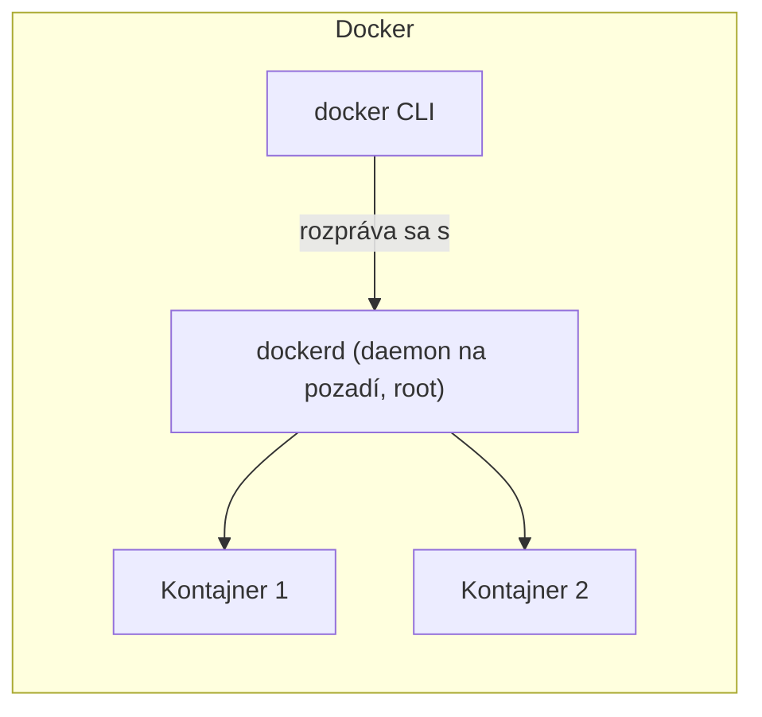
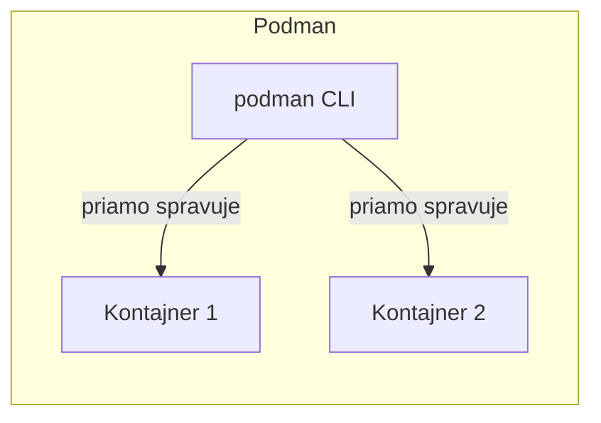

# Čo je Podman

**Podman** je container engine — ako Docker, buduje a spúšťa kontajnery z OCI-kompatibilných
image (rovnaký formát image, aký používa Docker), a jeho CLI je zámerne navrhnuté tak, aby
pôsobilo takmer identicky. Najväčší architektonický rozdiel je presne v tom, ako beží.

## Bezdémonový — hlavný rozdiel

Architektúra Dockeru sa spolieha na dlho bežiacu službu na pozadí, **Docker daemon** (`dockerd`),
s ktorým sa naozaj rozpráva každý `docker` CLI príkaz cez socket — daemon je to, čo naozaj buduje
image, spúšťa kontajnery, a spravuje všetko, zatiaľ čo CLI je len klient posielajúci mu
požiadavky.





Podman nemá **žiadny daemon na pozadí vôbec** — príkaz `podman` priamo vytvára a spravuje
kontajnery ako vlastné detské procesy, používajúc rovnaké podkladové Linux mechanizmy
(namespaces, cgroups — pozri
[Čo je Kontajner](/sk/study-materials/docker/basics/what-is-a-container) v Docker téme), ale bez
centrálnej vždy bežiacej služby koordinujúcej všetko.

## Prečo "žiadny daemon" je zmysluplný architektonický rozdiel, nie len trivia

- **Žiadny jeden bod zlyhania** — spadnutý alebo zaseknutý Docker daemon môže zhodiť *každý*
  kontajner, ktorý spravuje, keďže na ňom všetky závisia. Spadnutý `podman` proces ovplyvnil len
  jeden príkaz, ktorý práve bežal.
- **Jednoduchší model oprávnení** — daemon Dockeru tradične beží ako root, a `docker` CLI sa s ním
  rozpráva cez socket, ktorý efektívne udelí root-ekvivalentný prístup komukoľvek, kto sa k nemu
  vie dostať. Model Podman proces-na-kontajner sa tomu úplne vyhne (pozri
  [Rootless Predvolene](./rootless-by-default.md) pre priamy dôsledok tohto).
- **Procesy kontajnerov sú skutočné detské procesy** toho, čo ich spustilo — viditeľné v strome
  procesov normálnym spôsobom, nie skryté za vlastnou správou procesov samostatného daemona.

## CLI kompatibilita — zámerne, nie náhodou

```bash
podman run -d nginx
podman ps
podman build -t my-app .
podman exec -it my-app bash
```

Každý z týchto je identický s ekvivalentným `docker` príkazom — pozri
[Základy Podman CLI](../02-using-podman/podman-cli-basics.md) pre praktický rozsah tejto
kompatibility, vrátane doslovného triku `alias docker=podman`, ktorý mnohé nastavenia používajú.

## Kam Podman zapadá, relatívne k Dockeru

Podman nie je wrapper okolo Dockeru, a vôbec nevyžaduje nainštalovaný Docker — je to naozaj
nezávislá implementácia do veľkej miery rovnakých konceptov kontajnerov, vyvíjaná primárne Red
Hat, s rootless prevádzkou a tesnejšou Kubernetes/systemd integráciou ako hlavnými
odlišovačmi (pozri [Koncept Pod](./the-pod-concept.md) a
[Podman a systemd](../02-using-podman/podman-and-systemd.md)). Sekcia
[Docker vs. Podman](../03-docker-vs-podman/architecture-differences.md) pokrýva, ako sa tieto
rozdiely prejavujú v praxi, a kedy je ktorý naozaj lepšou voľbou.
